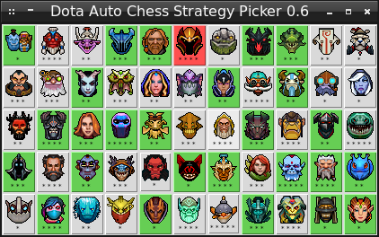

# Dota Auto Chess Picker 1.0 version

Dota Auto Chess Picker is a utility for showing combinations of pieces and items for the [Dota Auto Chess](https://steamcommunity.com/sharedfiles/filedetails/?id=1613886175) custom game. You can use the picker during the game (as a hint) or for planning your strategies.

A current development state is available in the [`CHANGELOG.md`](CHANGELOG.md) file.

## Installation

You need two Python 2.7, Tkinter and pillow modules to launch the Dota Auto Chess Picker.

### Windows

These are steps to install Python and required modules on Windows:

1. Download the archive with Dota Auto Chess Picker and extract it: 
https://github.com/ellysh/dota-auto-chess-picker/archive/master.zip

2. Download the Python 2.7 distribution: 
https://www.python.org/downloads/release/python-2715/

3. Install Python 2.7.

4. Install the pip utility with the following command in the command line: 
`python get-pip.py`

5. Install the `pillow` module: 
`pip install pillow`

### Linux

These are steps to install Python and required modules on Linux:

1. Download the archive with Dota Auto Chess Picker and extract it: 
https://github.com/ellysh/dota-auto-chess-picker/archive/master.zip

2. Install the Tkinter module: 
`sudo apt-get install python-tk`

3. Install the `pillow` module: 
`pip install pillow`

## Usage

### Pieces Picker

The `pieces-picker.py` script shows you all combinations of the pieces depending on their species and classes.

Start the `pieces-picker.py` script and click on the piece icon. The green color highlights all pieces of the same species. If the piece has second species, then corresponding pieces are highlighted by the yellow color. Blue color highlights the pieces with the same class. Purple color matches the pieces with the same species and class.

You will see a brief description of the piece's skill near the red box.

Stars under each piece icon show its cost.

### Items Picker

The `items-picker.py` script shows you combinations of items.

Start the `items-picker.py` script and click on the item icon. The red color highlights the selected item. You will see a description of this item at the bottom of the window. If the item can be combined in the upgrade, it is marked by the blue color. The green color highlights all components (if they exist) of the selected item. If the upgrade consists of two similar items, the corresponding item icon is highlighted by the yellow color.

Let us consider the screenshot above. The select item is Maelstorm. You can combine it with Hyperstone for getting Mjollnir. So, Mjollnir is marked by a blue color. You can get Maelstorm by the combination of Javelin and Mithril Hammer. Thus, these two items are highlighted by the green color.

Stars under each item icon show its tier. The `U` letter means that this is an upgraded item.

### Strategy Picker

The `strategy-picker.py` script shows you combinations of pieces according to predefined strategies. This script is recommended for new players who do not know all pieces well. It helps you to follow one strong strategy.

Start the script and click on the piece icon, which you have bought at the current round. The red color highlights the selected piece. The green color highlights all pieces which can make a combo with the selected one. You should follow the recommendation and click to the highlighted pieces when you buy them. You choice defines the following recommendations.

The strategies are defined in the `database/docs/Strategy.ods` file. These are steps to add a new strategy:

1. Open the document.
2. Add the name of your strategy in the first column.
3. Add comma separated pieces of your strategy in the second column. Use pieces names from the `PIECES` sheet of the `database/docs/Database.ods` document.
4. Use the `database/ods2csv.sh` script for generating all CSV documents. If you do not have Bash, you can manually save the `Strategy.ods` document to the `database/csv` directory with the `strategies.csv` name. Use the `;` as a separator for CSV document.

Now the `strategy-picker.py` script highlights your strategy.

### Combo Picker

The `combo-picker.py` script shows you strong combinations of pieces for each phase of the game. Using these combinations you can build your own strategy. This script is recommended for advanced players.

You see three tabs when starting the script: "Earlygame", "Midgame" and "Lategame". On each tab, there are lines with recommended combos. There are three columns: name of the combo, the preferred line for pieces in this combo ("Front", "Back", "Mixed") and icons of pieces in this combo.

When you buy pieces of the specific combo you can press on corresponding icons. Then these pieces will be highlighted by the red color in all combos on all tabs. So, you can continue building your strategy considering the pieces which you already bought.

Also, the green color highlights all pieces with the same species as pieces which you already bought. The same way, blue color highlights all pieces with the same classes.

The combos are defined in the `database/docs/Combos.ods` file. These are steps to add a new combo:

1. Open the document.
2. Add priority of your combo in the first column.
3. Add game phase of the combo in the second column.
4. Add the name of combo in the third column.
5. Add comma separated pieces of your combo in the fourth column. Use pieces names from the `PIECES` sheet of the `database/docs/Database.ods` document.
6. Use the `database/ods2csv.sh` script for generating all CSV documents. If you do not have Bash, you can manually save the `Combos.ods` document to the `database/csv` directory with the `combos.csv` name. Use the `;` as a separator for CSV document.

Now the `combo-picker.py` script shows your combo.

## Contacts

If you have any suggestions, bug reports or questions about usage of Dota Auto Chess Picker, please contact me via email petrsum@gmail.com.

## License

This project is distributed under the GPL v3.0 license
