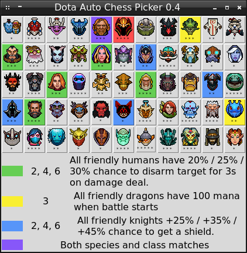
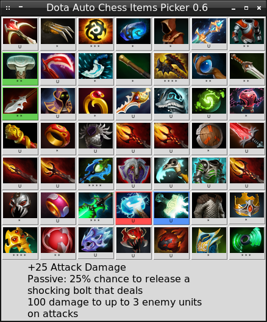

# Dota Auto Chess Picker 0.3 version

*This project is still in a developing stage.*

Dota Auto Chess Picker is a utility to check combinations of pieces and items.

A current development state is available in the [`CHANGELOG.md`](CHANGELOG.md) file.

## Installation

You need two Python 2.7, Tkinter and pillow modules to launch the Dota Auto Chess Picker.

### Windows

These are steps to install Python and required modules on Windows:

1. Download the archive with Dota Auto Chess Picker and extract it: 
https://github.com/ellysh/dota-auto-chess-picker/archive/master.zip

2. Download the Python 2.7 distribution: 
https://www.python.org/downloads/release/python-2715/

3. Install Python 2.7.

4. Install the pip utility with the following command in the command line: 
`python get-pip.py`

5. Install the `pillow` module: 
`pip install pillow`

### Linux

These are steps to install Python and required modules on Linux:

1. Download the archive with Dota Auto Chess Picker and extract it: 
https://github.com/ellysh/dota-auto-chess-picker/archive/master.zip

2. Install the Tkinter module: 
`sudo apt-get install python-tk`

3. Install the `pillow` module: 
`pip install pillow`

## Usage

### Pieces Picker

The `pieces-picker.py` script shows you all combinations of the pieces depending on their species and classes.

Start the `pieces-picker.py` script and click on the piece icon. The green color will highlight all pieces of the same species. If the piece has second species, then corresponding pieces will be highlighted by the yellow color. Blue color highlights the pieces with the same class. Purple color matches the pieces with the same species and class.

### Items Picker

The `items-picker.py` script shows you combinations of items.

Start the `items-picker.py` script and click on the item icon. The red color will highlight the selected item. You will see a description of this item at the bottom of the window. If the item can be combined in the upgrade, it will be marked by the blue color. The green color will highlight all components (if they exist) of the selected item.

Let us consider the screenshot above. The select item is Maelstorm. You can combine it with Hyperstone for getting Mjollnir. So, Mjollnir is marked by the blue color.  You can get Maelstorm by the combination of Javelin and Mithril Hammer. Thus, these two items are highlighted by the green color.

## Contacts

You can ask any questions about usage of Dota Auto Chess Picker via email petrsum@gmail.com.

## License

This project is distributed under the GPL v3.0 license
