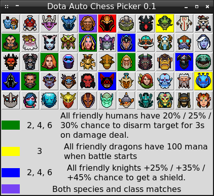

# Dota Auto Chess Picker 0.2 version

*This project is still in a developing stage.*

Dota Auto Chess Picker is a utility to check combinations of pieces.

A current development state is available in the [`CHANGELOG.md`](CHANGELOG.md) file.

## Concept

This utility shows you all actual combinations of the pieces depending on their species and classes.

## Installation

You need two Python 2.7, Tkinter and pillow modules to launch the Dota Auto Chess Picker.

### Windows

These are steps to install Python and required modules on Windows:

1. Download the Python 2.7 distribution: 
https://www.python.org/downloads/release/python-2715/

2. Install Python 2.7.

3. Install the pip utility with the following command in the command line: 
`python get-pip.py`

4. Install the `pillow` module: 
`pip install pillow`

### Linux

These are steps to install Python and required modules on Linux:

1. Install the `pillow` module: 
`pip install pillow`

## Usage

Start the `picker.py` script and click on the piece icon. All pieces of the same species will be highlighted by the green color. If the piece has second species, then corresponding pieces will be highlighted by the yellow color. Blue color highlights the pieces with the same class. Purple color matches the pieces with the same species and class.

## Contacts

You can ask any questions about usage of Dota Auto Chess Picker via email petrsum@gmail.com.

## License

This project is distributed under the GPL v3.0 license
